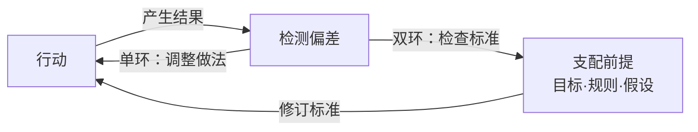

# 思维模型130：双环学习——复盘十遍还在同一个地方摔倒，，问题到底出在哪？

我们想象这样一支产品团队，虽然这样的团队现实中比比皆是，但是为了防止对号入座，我们姑且认为这是一个虚构的故事。

产品团队制定了固定的产品发布规划和时间，产品必须要在计划的日期发布，发布后却发现有缺陷，于是团队不得不回头返工修补。项目复盘时，大家找出了原因：测试覆盖不够，估时有偏差，信息同步也不够及时。于是团队要求增加检查表，要求更早时间报告风险，上线前加开协调会。这些办法都管用，bug确实少了，出现的问题的概率也降低了。

但是另一种情况还是防不住。测试时候发现了关键漏洞，无法在规划的上线时间内完成修复，可能要推迟上线日期，但是产品发布的节奏和时间是固定的，谁也不好意思提出延期。临近发布，大家往往把缺陷说得轻一些，先上线再说，回头再修复bug。比如某个接口在最后一轮测试中暴露了性能问题，修复需要三天，但日期已经对外公布了，于是决定先发布，性能问题排进下一版进行迭代。

这是很多产品开发团队都有的问题。检查表越做越细，到了必须在“按时发布”和“推迟修复”之间作取舍的时候，团队还是选择先上线。每次复盘都在改进，但每次到了上线的关口，决定仍旧和过去一样。

如果你也经历过这样的复盘，我们不妨回头想一想：**问题出现时，我们究竟按什么标准做决定？**

## 办法一直在改，什么始终没变？

哈佛大学教授克里斯·阿吉里斯（Chris Argyris）与麻省理工学院教授唐纳德·舍恩（Donald Schön）在20世纪70年代的研究中，区分了单环学习与双环学习。他们要回答的问题其实很朴素：发现问题之后，我们是只调整做法，还是连决定做法的标准也一起检查？

用一张图能看清两者的区别：

上面这条回路是单环学习：行动产生结果，检测到偏差，调整做法，再行动。标准不变，办法在换。

下面多出来的一条回路是双环学习：检测到偏差之后，不只调整做法，还往上走一步，检查支配做法的目标、规则和假设。如果标准本身有问题，就修订标准，再按新标准行动。多出来的这一步，就是“双环”和“单环”的区别所在。

**双环学习，是把决定我们怎么做事的目标、规则和判断前提也拿来检验，必要时加以修订，并在行动中按新的标准作决定。**

其中最容易被忽略的一点是：**大多数人卡住不是因为不够努力，而是从未检查过自己实际遵循的规则。更关键的是，他们以为自己遵循的就是嘴上说的那一套。**

我们把这个定义拆开来看，有三层意思。

**第一层，单环学习是换办法。**在既定判断标准内调整做法，标准本身不进入讨论。测试遗漏了就补充检查，流程慢了就优化流程，但“什么时候该上线”这个标准不碰。单环学习本身有价值，不是每次失败都需要质疑规则。

**第二层，双环学习是换标准。**不只问“怎么做更好”，还问“我们一直在遵循的这个规则，本身该不该修改”。有些规则不在任何制度文件里，但每次问题出现时它都在起作用。比如“已公布的日期不能动”这条规则，没有写在任何制度里，但每次到了取舍关口，它都在替团队做决定。

**第三层，双环学习是换行为。**标准修改了，做法也要跟着变。如果新规则写进了文件，但下次遇到同样的取舍，决定还是和过去一样，那只是修改了文字，不是修改了规则。判断双环学习有没有真正发生，不看制度文件有没有修改，看下一次实际问题出现时，大家的取舍有没有变。

这三层意思听起来有点抽象，用恒温器打个比方，能帮我们看清区别。温度偏离设定值，就开关暖气，这是按原来的标准纠偏，属于单环。如果连设定值是否合适也一起检查，比如问“为什么设在20度而不是22度？是有人怕冷，还是节能要求？”再据此调整，就回到了标准本身，属于双环。

回到开头的产品团队。增加检查表能减少遗漏，这是在换办法，属于单环。但“已公布的日期不能动”这个默认前提，一直没被检查过。如果返工一再发生，就该问问：为什么日期不能重新讨论？评价项目时，有没有漏算上线后的代价？

双环学习要检查的“规则”，既包括正式制度，也包括大家默认的取舍。有些规则没有写进制度，却决定着怎样才算成功，哪些代价可以忽略，谁的话值得听。

反复出错时要检查，有时候没出错也应该检查一下：如果原来的重要前提已经改变，或者某项关键规则根本不允许讨论，就该重新看看这条规则本身还成不成立。

那检查完发现规则本身没问题怎么办？如果证据表明原标准仍然合理，就继续用，没必要强行修改。检查本身有其价值，不是每次检查都必须做出修改。**至于双环学习是否真正发生，要看原来据以作决定的判断有没有改变，后面的行动有没有跟着发生变化。**

## 嘴上说质量优先，为什么行动总在保日期？

还是回到前面那支产品团队。负责人公开演讲强调质量，成员也都赞同。可延期会直接影响项目评价，上线后的返工却不计入原项目成本。

嘴上说的是质量优先，真正要作取舍时，先保住的却还是发布日期。这不是某个人在说谎，而是人们嘴上说的道理和实际遵循的道理，往往是两套。

阿吉里斯与舍恩把**人们声称自己遵循的那套道理，叫作“宣称理论”；从实际行动中能推断出的那套道理，叫作“使用理论”。**两者可能一致，也可能不一致，当事人未必察觉。比如负责人在会上说“质量第一”，但每次遇到日期冲突，实际选择都是保日期。嘴上说的是一套，实际遵循的是另一套，而他自己可能真心认为自己在按质量优先行事。

言行不一致，可能是本人没有察觉，也可能另有原因。如果察觉到了不一致，先别急着判断动机，看看当时哪些风险被提出了、哪些被搁置了，最后实际奖励了什么行为。

只是，一谈到当时为什么那样决定，讨论就可能变得不那么顺利。

追问“为什么返工不计入项目成本”，负责人可能觉得你在质疑他的评价方式；追问“为什么风险到最后才说”，成员可能担心接下来就要被追责。讨论于是又回到加检查表、加协调会这些操作上，绕开那些让大家都难堪的取舍。

久而久之，大家可能都习惯了绕开争议，连“为什么这件事不能谈”都没人再问。阿吉里斯把这种情况叫做“组织防卫”——**面对让人尴尬或难堪的问题时，人们自动启动自我保护，绕开真正需要讨论的事，结果反而让问题越来越难摆上桌面。**

他发现，人们在组织中实际遵循的隐性规则有几条共同特征：要实现自己的意图，在冲突中尽可能赢，抑制负面情感，保持理性。这些规则让人在面对威胁时启动自我保护，结果反而让真正需要讨论的问题越来越难摆上桌。组织防卫不需要阴谋，也不需要恶意。它往往只需要一个条件就够了：当质疑规则本身会让人尴尬时，大家就不质疑了。

比如团队越来越擅长把复盘会开得平和、顺畅，谁都不得罪，问题却一直没解决。开会的技能越熟练，问题被掩盖得越深。阿吉里斯把这种现象称为“熟练的无能”——**人们不假思索地擅长做某些事，但这些事带来的结果恰恰违背了本意。**“熟练”在于不假思索，“无能”在于结果不是想要的。

## 想改变规则，先从哪一次取舍开始？

一句“大家要深刻反思”，很难让这样的团队知道从哪里开始修改。反思需要一个抓手。不妨拿出最近一次需要取舍的决定，先检查其中一条规则。下面四步是双环学习的使用指南。

**第一步：还原一次取舍，先拿出记录。**

找出当时的风险说明、会议记录、最终决定，以及后来的返工记录。谁提出过什么意见，决定是怎么作出的，后来又付出了哪些代价，都从这里开始检查。

先别用一句“领导不重视质量”解释一切。当时选择按期发布，也可能是因为缺陷可控，而延期的代价更大。需要弄清的是：大家有没有认真比较不同方案？如果比较了，比较时算进了哪些代价、漏掉了哪些？如果根本没比较，是因为不允许讨论日期，还是没人觉得需要讨论？

**第二步：把推测的规则写出来，请当事人共同检验。**

例如：“我们好像默认，已公布日期不能重新讨论，上线后的返工也不影响原项目评价。”

先把这句话当作一个猜测。列出支持它的记录，也请当事人看看有没有反例。如果只有印象，找不到记录，就先补充证据，别急着认定这就是根因。

**第三步：商定有限修订，明确谁来决定。**

如果大家对照记录后发现，这条规则一次次让关键风险进入不了讨论，返工的代价也没算进去，就可以找有决策权的负责人，商量怎么修改。

先说规则怎么修改。哪些发布条件必须满足，出现哪些缺陷就得重新讨论，这些是不能妥协的底线。对于可以权衡的情况，把延期的代价和带着缺陷发布的代价放在一起比较，相关返工也要计入项目评价。简单说，就是让“先上线再说”这个选择不再那么容易做，做之前得把代价摆出来比一比。

再说谁来执行。谁接收风险报告，谁能暂缓发布，最后由谁拍板，这些都要事先约定。评价一份有依据的风险报告，要看信息是否可靠、判断是否合理，不能只因为它打乱了计划，就给报告者贴上“不配合”的标签。缺陷到底有多严重，一时判断不清楚，就约定由谁补充哪些信息，什么时候重新决定。

**第四步：回看下一次问题出现时，检查行为与结果。**

下次出现符合重审条件的缺陷时，看看是否真的重新讨论了，相关信息有没有用于比较方案。再看报告风险的人是否受到公平评价，最后作决定的理由有没有留下记录。

这些记录能帮助我们判断，新规则有没有被用起来。即便最终还是按时发布，也不意味着什么都没变：同样的结果，可能已经经过了不同的判断。

接下来还要看效果。返工有没有减少，用户受到什么影响，延期又付出了多少代价。这一次按新规则作了决定，下次遇到类似情况还会不会这样做？新办法有没有解决问题，有没有带来新的麻烦？这些都要继续看。

新规则有没有照着执行，执行以后有没有用，得分开看。

## 补上眼前的缺口，就算学会了吗？

前面说的是产品团队。换一个场景，看看医院里的情况。

宾夕法尼亚大学沃顿商学院的安妮塔·塔克（Anita L. Tucker）与哈佛商学院教授埃米·埃德蒙森（Amy C. Edmondson）在2003年发表的一项研究，花了188个小时观察七家医院的21位护士。文中记下了这样一幕：一位夜班护士发现干净床单不够，没有通知供应部门，而是直接到其他病区取来，照护工作得以继续。床单找来了，短缺的原因却没有因此得到处理。供应环节甚至不知道出过这个问题。

先找来床单，当然有必要。可如果每次都靠护士临时弥补，供应环节就可能收不到反馈，也就少了一次查明原因的机会。**这次有床单可用了，下次还会不会缺，问题仍在那里。**

即便调整了补货时间，也可能只是改进了做法。但如果一个团队开始重新看待“好员工就该自己解决麻烦，不要向上反映”这条默认要求，并改变对报告问题的评价，就把原来指导做事的标准也拿来检查了。这个团队做的，已经不是护士在做的事了：从弥补缺口，变成了检查那条让缺口反复出现的规则。

## 下次复盘，从一份决策记录开始

我们讲了这么多，不是让你每次失败都去质疑规则。如果只是操作有遗漏，把操作做好就行。眼前有风险需要处置，也要先处理，不能等讨论完规则再动手。

但如果办法换了几轮，同样的问题还是会出现，就拿出最近一次决策记录，问问：**当时按什么标准作了取舍？有没有一条重要规则，始终没有被检验？**

先挑一条值得检查的规则，和有权限的人一起核对依据。确实需要修改，就作一项有限的修订，再看下一次大家怎么做。

下次再有人提出同样的风险，让这些信息进入讨论，看看它们会怎样影响决定。

双环学习提醒我们一件事：当你反复改进同一个问题却始终绕不开它，别急着问“怎么做更好”，先问一句：这次决定到底按谁的规则做的？那条规则，写在哪里？问题出现的时候，它真的管用吗？

---

## 模型档案卡

| 板块    | 内容                                                                                          |
| ----- | ------------------------------------------------------------------------------------------- |
| 模型名称  | 双环学习（Double-Loop Learning）                                                                  |
| 一句话定义 | 检验支配行动的目标、规则和判断前提，在必要时修订，并让新的判断进入实际行动。                                                      |
| 来源    | 哈佛大学教授阿吉里斯与麻省理工学院教授舍恩在20世纪70年代提出；共同著作《Theory in Practice》（1974），阿吉里斯在《哈佛商业评论》发表标志性文章（1977）。 |
| 核心区分  | 单环调整既定标准内的做法；双环触及支配这些做法的标准。                                                                 |
| 调用提示  | 问题反复、重要前提改变，或某项关键规则始终不许讨论时，检查实际取舍。                                                          |
| 应用方法  | 还原一次取舍，共同检验实际规则，商定有限修订，回看行为与结果。此流程为本文应用整理。                                                  |
| 使用边界  | 不把反复失败当成规则必错的证明；不为改变而改变；改流程、改文件不等于完成双环学习，单次改善也不能证明长期有效。                                     |

---

这是思维模型系列的第130篇。

如果你的团队也在一遍遍复盘、一遍遍返工，可以把这篇文章转给一起复盘的同事。拿出最近一次决定，看看有没有一条重要规则，始终没有被认真讨论过。